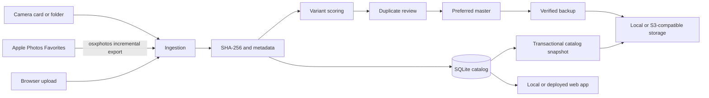

# Architecture and roadmap

## Design principles

- Originals are immutable. The catalog records state; it does not rewrite source media.
- Identity is content-based. A filename is evidence for a variant match, never the primary key.
- Uncertainty is visible. Weak variant matches require review and remain protected.
- Backup providers are replaceable. The application depends on an S3-compatible interface, not an AWS-specific data model.
- Local and hosted installations use the same API and browser interface.

## Data flow

## Catalog model

- `photos`: one row per unique byte stream, with technical metadata and perceptual hash
- `locations`: every known local path and its source/favorite state
- `variant_groups` and `variant_members`: visually related encodings or exports with a chosen master
- `backups`: provider/object/status records for logical photos
- `tags` and `photo_tags`: general-purpose classification
- `magazine_selections`: per-issue editorial status and notes
- `editorial_flags`: the current flagship, include, candidate, one-of, or not-included decision for each photo

SQLite runs in WAL mode. Each backup uses SQLite's online backup API to produce a consistent catalog snapshot.

## Matching behavior

Exact duplication uses streaming SHA-256. Variant scoring combines perceptual-hash Hamming distance, capture-time distance, normalized filename, and aspect ratio. A score at or above `PHOTO_VARIANT_CONFIRM_THRESHOLD` is confirmed automatically. Scores between the suggest and confirmation thresholds create a pending group.

Master selection ranks pixel count first, then RAW format, then file size. The reviewer can override that decision.

## Deployment topology

Use one authoritative catalog per installation. The current release supports either:

- a local Mac service with directly mounted camera folders and an optional cloud archive, or
- a hosted service with browser uploads, persistent catalog storage, and S3-compatible originals.

Running independent local and hosted catalogs against one bucket is not supported yet. The hosted instance does not discover writes made only to a local database.

## Roadmap

### Production hardening

- PostgreSQL catalog and database migrations for multi-instance hosting
- Background workers, resumable multipart uploads, retry queues, and progress events
- Provider inventory reconciliation and an explicit, audited redundant-object prune command
- Encrypted secret management, OIDC/passkeys, rate limiting, and per-user authorization
- Automated restore drills and versioned catalog retention

### Local/remote continuity

- Authenticated local agent that sends scans and uploads to one hosted catalog
- Offline queue and resumable synchronization
- macOS launch agent for scheduled iPhone Favorites export and backup
- Camera-card watcher with ingest receipts before eject

### Editorial workflow

- Issue collections, contact sheets, ordering, captions, crops, and export presets
- Search by EXIF, date, location, people, and semantic embedding
- Non-destructive edit/version relationships and sidecar preservation
- Magazine layout integration and delivery manifests
